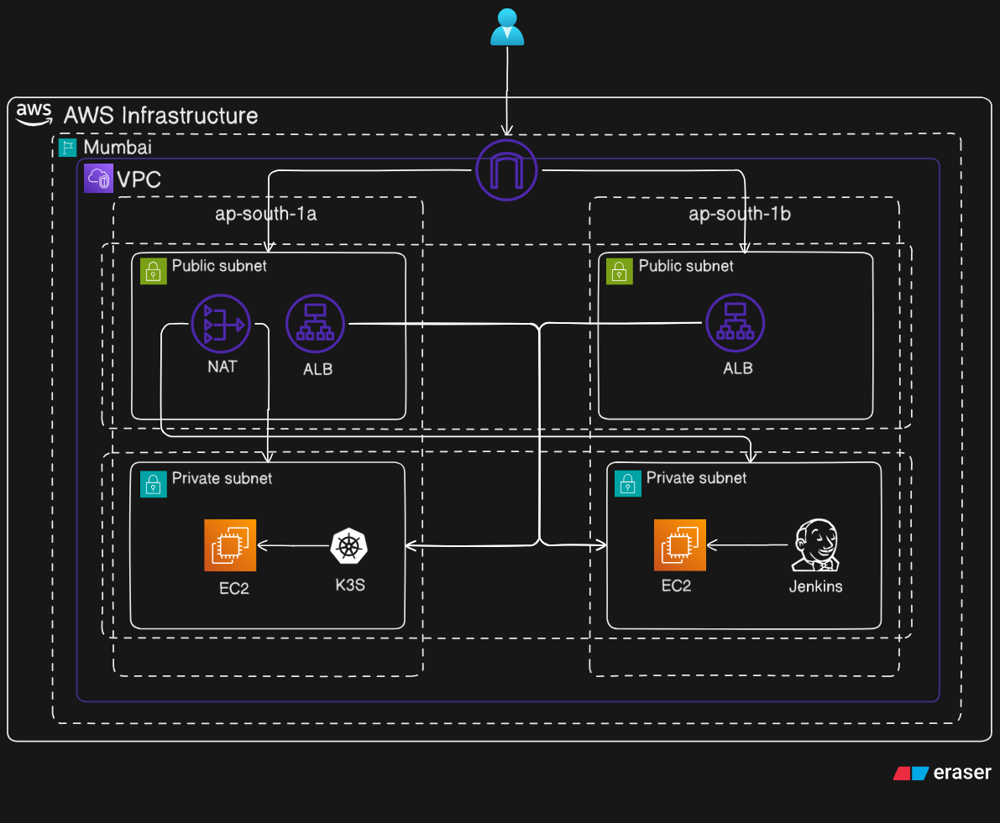

# 🏗️ Infrastructure as Code (Terraform) - AWS 

This directory contains the Terraform configuration used to provision a highly available, secure, and isolated cloud environment on AWS (Mumbai Region).

## 🌐 Network Architecture

The infrastructure is designed using a **Multi-AZ (Availability Zone)** strategy to ensure fault tolerance and security.

### **1. VPC Strategy**
* **VPC:** A dedicated Virtual Private Cloud provides a logically isolated network.
* **Public Subnets (Tier 1):** Distributed across `ap-south-1a` and `ap-south-1b`. These house the **Application Load Balancers (ALB)** and the **NAT Gateway**.
* **Private Subnets (Tier 2):** Isolated subnets where the actual compute workloads reside. These have no direct internet access.

### **2. Security & Isolation**
* **Private Compute:** Both the **Jenkins (CI)** and **K3s (Kubernetes)** nodes are located in private subnets.
* **NAT Gateway:** Allows instances in private subnets to download updates and Docker images securely without exposing them to inbound internet traffic.
* **ALB (Application Load Balancer):** Acts as the single entry point for user traffic, distributing requests across the availability zones to the private K3s nodes.

---

## 🚀 Environment Management (Workspaces)

To maintain a **DRY (Don't Repeat Yourself)** codebase, we utilize **Terraform Workspaces**. This allows us to manage different environments (Dev, Prod) using the same configuration files.

* **Workspace Used:** `dev`
* **Benefit:** Isolates state files for different environments, ensuring that changes in Development do not accidentally impact Production resources.

## 🛠️ Resources Provisioned

| Resource | Location | Purpose |
| :--- | :--- | :--- |
| **Jenkins EC2** | Private Subnet (`ap-south-1b`) | Dedicated CI server for building and scanning microservices. |
| **K3s Master EC2**| Private Subnet (`ap-south-1a`) | Lightweight Kubernetes control plane managing the application pods. |
| **Public ALB** | Public Subnets (Multi-AZ) | Handles external traffic and routes it to the K3s cluster. |
| **NAT Gateway** | Public Subnet (`ap-south-1a`) | Provides outbound internet for private instances. |
| **Internet Gateway**| VPC Level | Enables communication between the VPC and the internet. |

---

## 📖 Setup & Tutorial
For a detailed guide on installing the Terraform, and running the infrastructure, please refer to the documentation in the root `docs` folder:

👉 [IaC Tutorial](../docs/terraform/README.md)